# 算法设计与分析实验报告


## 一 实验题目

##### 问题描述:

网格上有若干个货物和仓库，可以往水平方向或垂直方向搬运每个货物到相 邻的仓库中。每个仓库只能容纳一个货物。至少使用两种思路求让这些货物放到 不同仓库所需要的搬运最小路程（单位：格）

##### 输入描述:

第一行输入n和m代表网格地图的行列数，之后输入如下网格地图：

- 大小为n*m （1<n,m<100），地图中的`W`和`G`分别表示仓库和
  货物的位置，个数相同，最多有 100 个仓库，其它空位置用`.`表示

##### 输出描述:

所需要的最小路程

##### 输入样例:

```
7 8
...W....
...W....
...W....
GGGWGGGG
...W....
...W....
...W....
```


## 二 实现思路及源代码

### 题目分析：

因为题目说明货物和仓库**数量一致**，且每个仓库**只能容纳一个货物**，那么输入所给的网格地图的**有用信息只有仓库和货物的位置信息**。

由此可以将网格地图提取为点，而问题也就变成使这些点一一对应的距离和最小

##### 源代码：

文件为[code/Final/Utils.h](code/Final/Utils.h)

经过上述分析，代码首先要做的就是提取输入信息

```c++
#ifndef UTILS_H
#define UTILS_H
#include <iostream>
#include <vector>
#include <cstring>

using namespace std;

int n = 0, m = 0;   //输入矩阵的行列数
vector<vector<char>> input; //输入矩阵
vector<pair<int, int>> W;   //仓库点的信息，pair用于记录其在矩阵的位置
vector<pair<int, int>> G;   //货物点的信息，pair用于记录其在矩阵的位置

//获取输入矩阵
void GetInput(int n, int m){ 
    input.resize(n);
    for (int i = 0; i < n; i++) //输入矩阵
    {   
        input[i].resize(m);
        for (int j = 0; j < m; j++)
        {
            cin >> input[i][j];
        } 
    }
}
//求两个节点的曼哈顿距离
int distance(pair<int, int> x, pair<int, int> y)
{
	return abs(x.first - y.first) + abs(x.second - y.second);
}
//提取输入矩阵的信息
void ExtractMatrix(){
    for (int i = 0; i < n; i++) {
        for (int j = 0; j < m; j++) {   //将货物和仓库的位置信息存入数组
            if (input[i][j] == 'W') W.push_back(make_pair(i, j));
            else if (input[i][j] == 'G') G.push_back(make_pair(i, j));
        }
	}
}
//清空
void CleanUp(){
    for (int i = 0; i < input.size(); i++)
    {
        input[i].clear();
    }
    input.clear();
    G.clear();
    W.clear();
}
#endif
```

- 网格地图重要的便是提取**仓库和货物的位置信息，所以设置两个数组分别存储仓库、货物的坐标(i，j)**，坐标用`pair<int, int>`存

- 分析中提到，问题转化为**仓库和货物一一对应的距离和最小，这里的距离采用曼哈顿距离**

- ##### 其余部分代码均有注释，便不再赘述


### 思路一：

> ### 将问题转化为最小权二部图匹配问题，再使用引入新边的匈牙利算法，即KM算法求解

##### 主要思想：

上述题目分析提到，问题转化为**仓库和货物一一对应的距离和最小**，其中一一对应是因为题设仓库和货物数目一致且一个仓库只能装一个货物，**那么就是寻找仓库和货物的完美匹配**，再引入仓库货物间的距离作为权值，**便是ppt的7.8节改进后的匈牙利算法**，由此将问题转化为求**最小权的完美匹配。**那么有求解过程如下：

1. 先使用提取出的货物和仓库信息

2. 为仓库和货物点集分别设置标号，对仓库标号都设为0，货物的标号设为最小权值(最近的仓库的距离值)，根据标号绘制带权二部图

   - 标号：也就是可以作为二部图边的标准，此处为距离，只有货物与仓库的距离小于设置的**两个标准和**，**才能作为未匹配边，加入二部图**

     - ##### 代码实现中，事先绘制好二部图，货物与仓库全相连，但是根据标号来判断是否进行匹配的计算

3. 设置松弛度，使用**匈牙利算法**更新匹配

   - 松弛度用于寻找增广路，为0代表当前最优匹配
   - 直到找不到增广路径且未达到完美匹配

4. 重新调整货物和仓库的标号，但要保证货物和仓库对应节点标号求和不变，**由此往二部图中增加新边**

5. 回到3.，使用匈牙利算法更新匹配，直到达到完美匹配

6. 计算完美匹配的权，即为结果


##### 流程图：

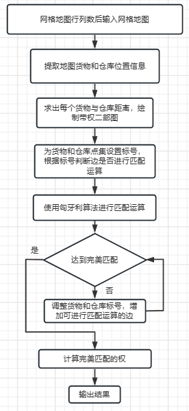


##### 公式辅助说明：

根据题意，设有完全二部图` G = <A, B, E ,w>`

- A为货物节点集，B为仓库节点集，E为未匹配边集，w为权重(距离)
- A与B全连接，即A与每一个B**都有一条未匹配边**

初始化Bj的标号`βj(1<=i<=n)`为0，而Ai的标号`αi(1<=i<=n)`为与B相连的所有边中权最小的。设置松弛度`si`，`si == 0`代表当前节点为当前最佳匹配，只有当Ai与Bj构成的边Eij的权值`wij`有`wij <= αi + βj`时，**Eij才可作为未匹配边进行匹配运算**

接下来设有初始匹配M，使用匈牙利算法对满足`wij- αi - βj < si`的边进行匹配计算，即寻找Ai对应的非饱和的Bj，由此构成增广交错路径，若`si == 0`则边化为匹配边。之后修改匹配，重新标号，直到A中找不到增广交错路径或者达到完美匹配。

- ##### 因为每次取B都是取权值最小的，类似于贪心，所以最后完美匹配的结果的权值之和一定是最小的。

若未达到完美匹配，则更新`si = min(si, wij- αi - βj)`，再回到刚刚的匈牙利算法，直到完美匹配


##### 举例说明:

输入：

```
5 5
WW..G
.W...
.....
....W
G.G.G
```

对输入数据提取信息后绘制出二部图进行分析

|      初始带权二部图       |      第一次查找匹配       |
| :-----------------------: | :-----------------------: |
| 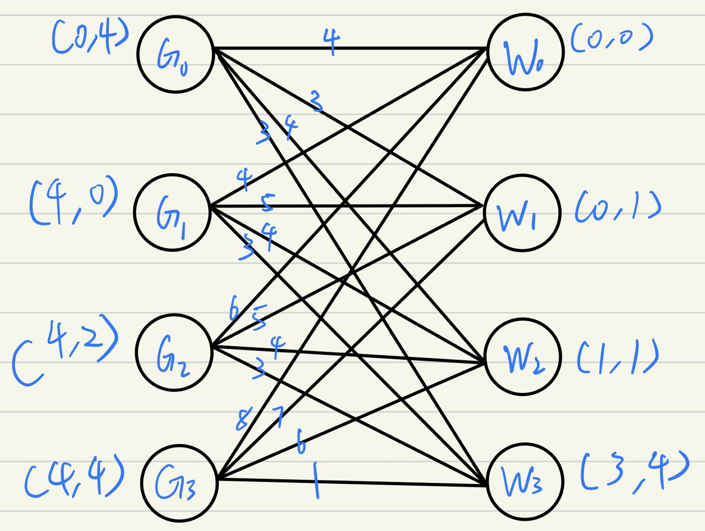 | 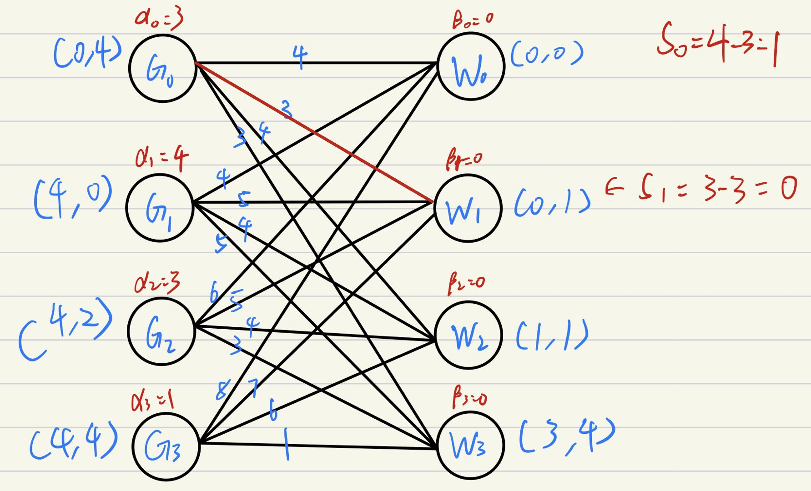 |

- 初始带权二部图中，节点旁为其在网格地图的坐标，边上权重为两个坐标的曼哈顿距离
- 第一次查找匹配，G0和W1为最优匹配

|      第二次查找匹配       |      第三次查找匹配       |
| :-----------------------: | :-----------------------: |
| 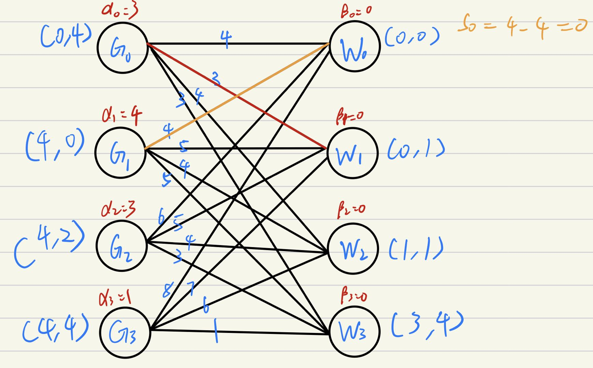 | 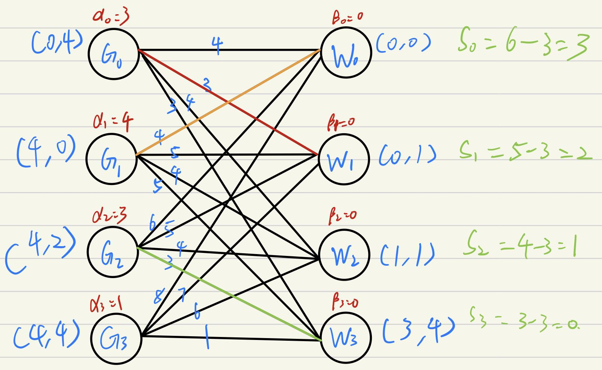 |

- 第二次查找匹配中，G1和W0为最优匹配
- 第三次查找匹配中，G2和W3为最优匹配

|   第四次第五次查找匹配    |   第六次第七次查找匹配    |
| :-----------------------: | :-----------------------: |
| 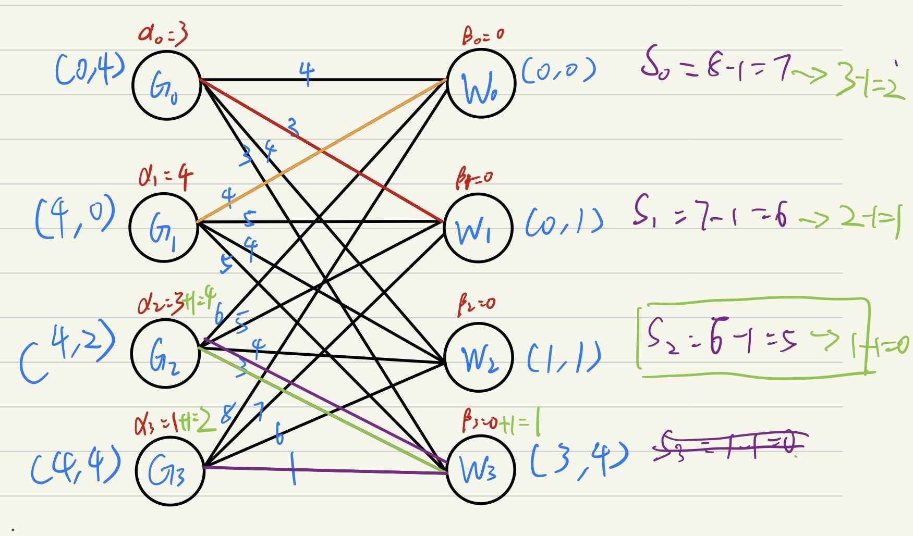 | 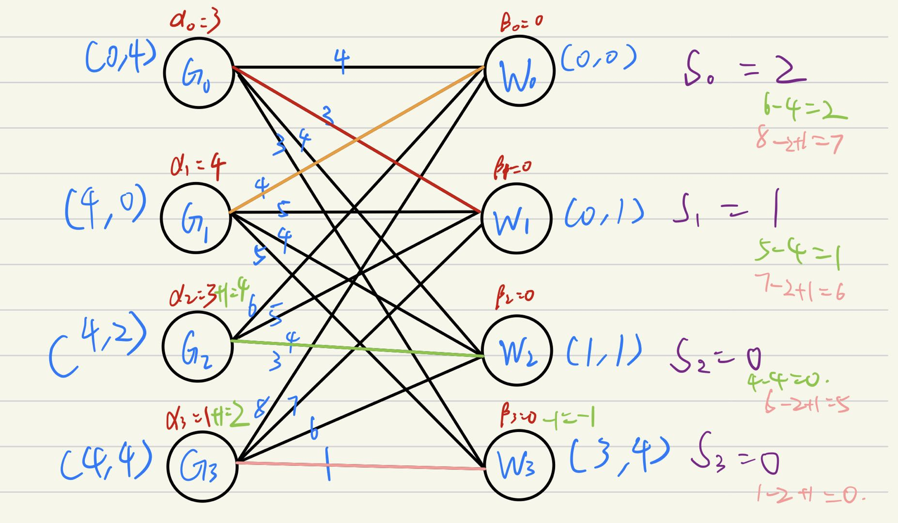 |

- 第四次查找匹配中(图中紫色字样)，α3+β3 = 1，最佳匹配应该为W3，但是W3已经被匹配，所以回到对G2的查找匹配(第五次查找匹配)寻找增广路径`G3-W3-G2-?`，同时更新最小si(图中绿色箭头所指数字)，因为α2+β2 = 3，所以没有增广路径。

  那么需要使用si对α3+β3 进行松弛，选择当前最小的s2 = 1，通过给寻找的增广路径节点的标号增加s2进行松弛，即G3、W3、G2的标号α3、β3、α2分别+1，旧的si全部-1。

- 第六次查找匹配便是接上上一步得出的α3、β3、α2以及si，重新进行对G2的查找匹配：此时最优匹配`wij - α2 - β2 = 4 - 4 - 0 = 0 `，由此W3空出。第七次查找匹配对G3而言，就有最优匹配`wij - α3 - β3 = 1 - 2 - -1 = 0 `。至此二部图完美匹配，所以有最短距离`r = 3 + 4 + 4 + 1 = 12 `


##### 源代码：

文件为[code/Final/Idea_1.h](code/Final/Idea_1.h)

```c++
#ifndef IDEA_1_H
#define IDEA_1_H
//思路一：转化为最小权的二部图匹配问题，再使用能引入新边的匈牙利算法，也就是KM算法求解
#include "Utils.h"

vector<pair<int, int>> Graphic[120];    //二部图,最多100个仓库，怕有意外设120
//绘制赋权完全二部图
void makeGraphic(){
    for (int i = 0; i < G.size(); i++)
    {
        for (int j = 0; j < W.size(); j++) 
        {
            int weight = distance(G[i], W[j]);  //求权  
            Graphic[i].push_back(make_pair(j, -weight)); //i与j的带权非匹配边,求最小权所以为负
        }
    }
}

bool visit_A[120], visit_B[120];    //标记寻求增广路时，A和B的点是否已经被查询
int Match[120];     //匹配结果，Match[A_i]=B_j，Match[B_j]=A_i，标识A_i与B_j已经匹配
int l_A[120], l_B[120];   //A中标号和B中标号，用最小权
int s[120]; //存到s[i]的最小权，扩大便代表松弛，从而可以找到增广交错路径

//同匈牙利算法，给A_t找匹配
bool searchMatch(int t){
    visit_A[t] = 1;     //正在查询A_t
    int temp_weight, temp_index;    //查询与A_t邻接的点的编号和权重
    for (int i = 0; i < Graphic[t].size(); i++) //查询邻接点
    {
        temp_weight = Graphic[t][i].second;
        temp_index = Graphic[t][i].first;
        if (visit_B[temp_index]) continue;  //如果该邻接点已被查询，则跳过
        int temp = l_A[t] + l_B[temp_index] - temp_weight;
        if (temp != 0)  //找不到增广交错路径
        {
            s[temp_index] = min(s[temp_index], temp);  //松弛最小权
        } else {    //temp_index可以作为增广节点
            visit_B[temp_index] = 1;
            if ((Match[temp_index] == -1) || (searchMatch(Match[temp_index]))) //若temp_index未匹配
            {
                Match[temp_index] = t;  //temp_index暂时作为匹配
                return true;
            }
        }
    }
    return false;   
}
//Kuhn-Munkras算法
int KM(){
    //初始化
    memset(Match, -1, sizeof(Match));
    memset(l_B, 0, sizeof(l_B));    
    for (int i = 0; i < G.size(); i++)
    {
        for (int j = 0; j < Graphic[i].size(); j++)
        {
            l_A[i] = max(l_A[i], Graphic[i][j].second); //A标记初始化用权值的最大值
        }
    }
    //不断更新A中点的标记，直到所有点被标记且查询，即找到完美匹配
    for (int i = 0; i < G.size(); i++)
    {
        for (int i = 0; i < sizeof(s); i++)
        {
            s[i] = 65536;   //初始化s
        }
        while (1)
        {
            memset(visit_A, 0, sizeof(visit_A));    //初始化查询数组
            memset(visit_B, 0, sizeof(visit_B));
            if (searchMatch(i)) break;  //A_i在相等子图找到了匹配,继续为下一个点找匹配 
            int temp = 65536;
            for (int j = 0; j < W.size(); j++)  //更新最小权
            {
                if (visit_B[j] == 0) temp = min(temp, s[j]);
            }
            if (temp == 65536) return -1;   //找不到完美匹配
            for (int j = 0; j < G.size(); j++)
            {   //所有已搜索过的A减少相同的量，减少权重
                //从而增加未匹配A的选择可能
                if (visit_A[j]) l_A[j] -= temp;
            }
            for (int j = 0; j < W.size(); j++)
            {
                //权重和标记内容保持一直，因为标记用的最小权
                if (visit_B[j]) l_B[j] += temp;
                else s[j] -= temp;
            }    
        }
    }
    //计算完美匹配权值之和
    int result = 0;
    for (int i = 0; i < W.size(); i++)
    {
        if (Match[i] != -1)
        {
            for (int j = 0; j < Graphic[Match[i]].size(); j++)
            {
                if (Graphic[Match[i]][j].first == i)	//加上每一条匹配边的权
                    result += Graphic[Match[i]][j].second;
            }
        }
    }
    return -result;
}
//使用思路一求解
void Idea1(){
    cout << "Here is Idea_1 : input \"0 0\" to end " << endl;
    while ((cin >> n >> m) && (n > 0) && (m > 0)) { //多次输入
        if ((n == 0) && (m == 0)){
            cout << "End of Idea_1" << endl <<endl;
            return;
        }
        GetInput(n, m);     //输入
        ExtractMatrix();    //提取输入
        if (W.size() != G.size()){  //排错
            cout << "The number of warehouse and goods is inconsistent, Idea_1 is over" <<endl;
            return;
        }    
        makeGraphic();   //带权二部图
        cout << "The minimum distance : " << KM() <<endl; 
        for (int i = 0; i < 120; i++)   //清空网络，为新的网络服务
        {
            Graphic[i].clear();
        }
        CleanUp();
    }
}
#endif
```

- `makeGraphic`为画带权二部图的函数；`searchMatch`便是匈牙利算法中查找匹配的函数；`KM`虽然命名为KM，但是要和`searchMatch`合起来才叫KM算法，`KM`主要的部分就是初始化标号、在未有完美匹配的时候进行对标号松弛，以及最后计算完美匹配的权值之和

- 因为求的是最小权，所以绘图时的权重输入为**距离的负数，越短的距离，所以KM算法中权值越大**。

- ##### 其余部分代码均有注释，便不再赘述


### 思路二：

> ### 将问题转化为最小费用最大流问题，并使用最小费用流的最短路径算法求解

##### 主要思想：

在思路一中，我们得到了全连接的二部图，如果给思路一的图像加入源点和汇点，得到的图像与**一个带有顶点和容量的费用网络**非常类似。由此为启发，认为本问题可以转化为最小费用最大流问题

在题目分析中**提取出的网格地图的信息**可以构成**货物指向仓库的简单的有向带权图。**若只求最短路径，那么可以使用最短路径算法解决。但是还有**每个仓库只能容纳一个货物的限制条件，**就意味着每一条货物指向仓库的路径只能有一个货物通过，这相当于给上述有向带权图的所有边增加流量限制，限制流量为1。那么可以画出带顶点和容量的的费用网络，如下：

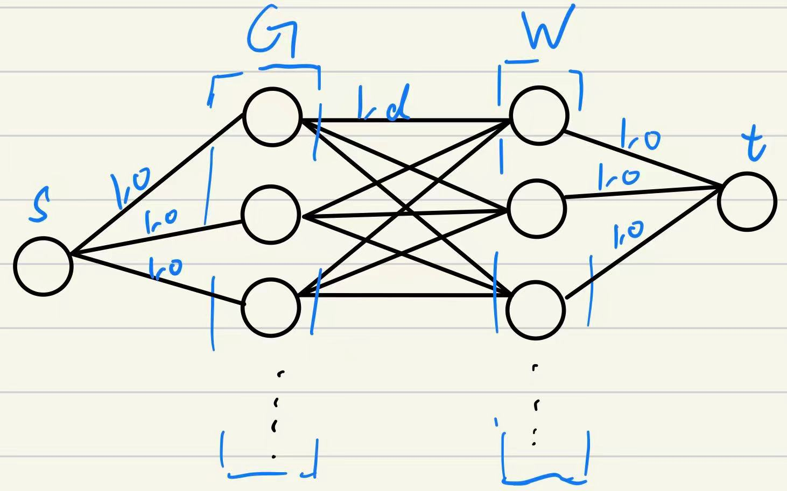

- 即**全图的边容量全为1**，源点到所有货物、所有仓库到汇点的费用为0，货物到仓库的费用就为**相互间的距离**

由此将问题转化为最小费用最大流问题，那么就可以使用最小费用流的最短路径算法求解，那么有求解过程如下：

1. 全图从零流开始作为最小费用流，设有给定给定流量
2. 如果最小费用流的流量小于给定流量，使用**最短路径算法**寻找费用最少的s-t增广链
   - 因为图中只有单向边，所以使用**单源最短路算法spfa**
3. 修改增广链上边的流量，并计算链上可行流，之后得出可行流的费用。
4. 若可行流流量不等于给定流量，回到2.，否则得到最小费用流
   - 题设仓库和货物数量一致且一一匹配，所以条件可以转为所有仓库货物节点需要被唯一一条增广链选择

- 能确保以上一定是最小费用流，是因为使用最短路径算法寻找增广链


##### 流程图：

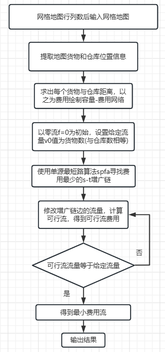


##### 公式辅助说明：

根据题意，设有容量费用网络` N = <V, E, c, w, s, t>`

- 其中$V  = \{s,t,G_1,G_2,...,G_n,W_1,W_2,...,W_n\}$，即源点、汇点、所有货物和所有仓库
- $E = \{ <s,G_i>|1≤i≤n\} \cup\{<W_j,t> |1≤j≤n\} \cup\{ <G_i,W_j>|1≤i≤n,1≤j≤n\} $

- $c(s,G_i)=1$， $w(s,G_i) = 0$， $1≤i≤n$
- $c(W_j,t)=1$， $w(W_j,1) = 0$， $1≤j≤n$
- $c(G_i,W_j)=1$， $w(G_i,W_j) = w_{ij}$， $1≤i,j≤n$
  - $w_{ij}为G_i与W_j的曼哈顿距离$

那么就有给定流量$v_0=1*n=n$，和初始化最小流$f=0$。因为s-Gi和Wj-t的费用都为0，所以增广链的寻找只要使用spfa从$E=\{ <G_i,W_j>|1≤i≤n,1≤j≤n\}$找到最短路径即可。

根据找到的最短路径得到可行流f'，由此更新对应节点的c。

反复寻找s-t增广链直到v(f') == v0 。

- 因为题设仓库和货物数量一致，且要一一匹配，所以可以理解为所有的$E=\{ <s,G_i>|1≤i≤n\}\cup \{ <W_j,t>|1≤j≤n\}$都要有流量经过。


##### 举例说明:

输入

```
5 5
WW..G
.W...
.....
....W
G.G.G
```

|    初始容量-费用网络图    |     第一次查找增广链      |
| :-----------------------: | :-----------------------: |
| 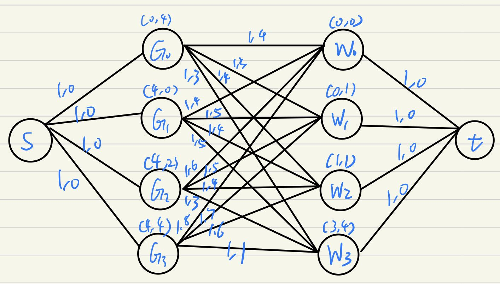 | 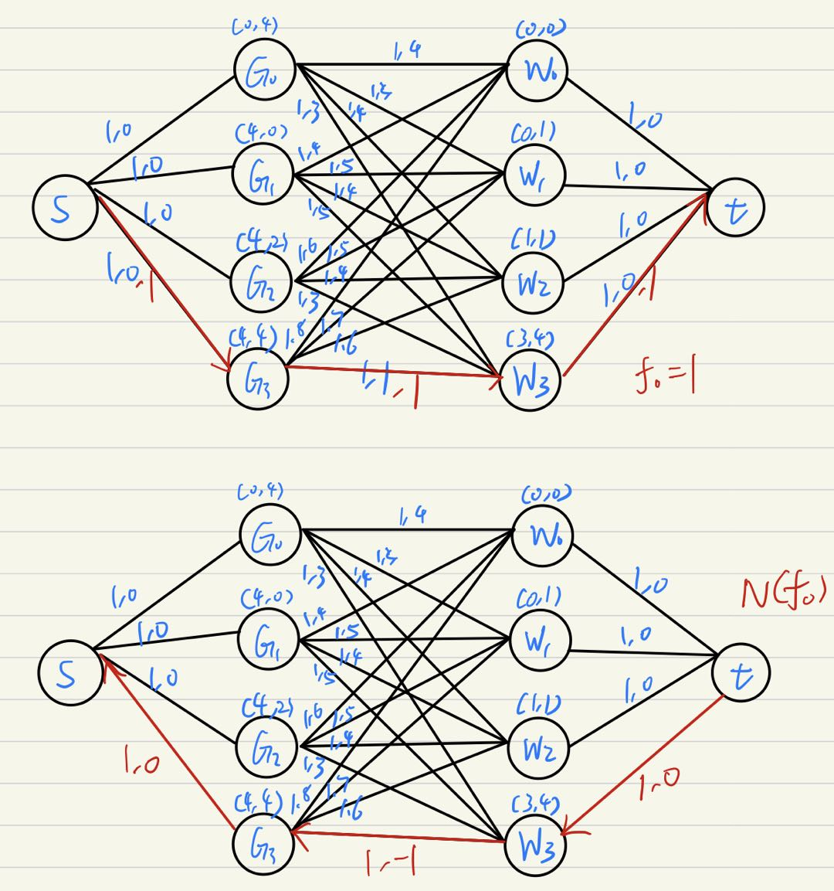 |

- 初始容量-费用网络中，节点旁为其在网格地图的坐标，边上为`(容量，为两个坐标的曼哈顿距离)`，有给定流量v0=4
- 第一次查找增广链，用spfa找到最短增广链`s-G3-W3-t`，得到可行流f0=1，更新网络N(f0)，有最少费用result=1

|     第二次查找增广链      |     第三次查找增广链      |
| :-----------------------: | :-----------------------: |
| 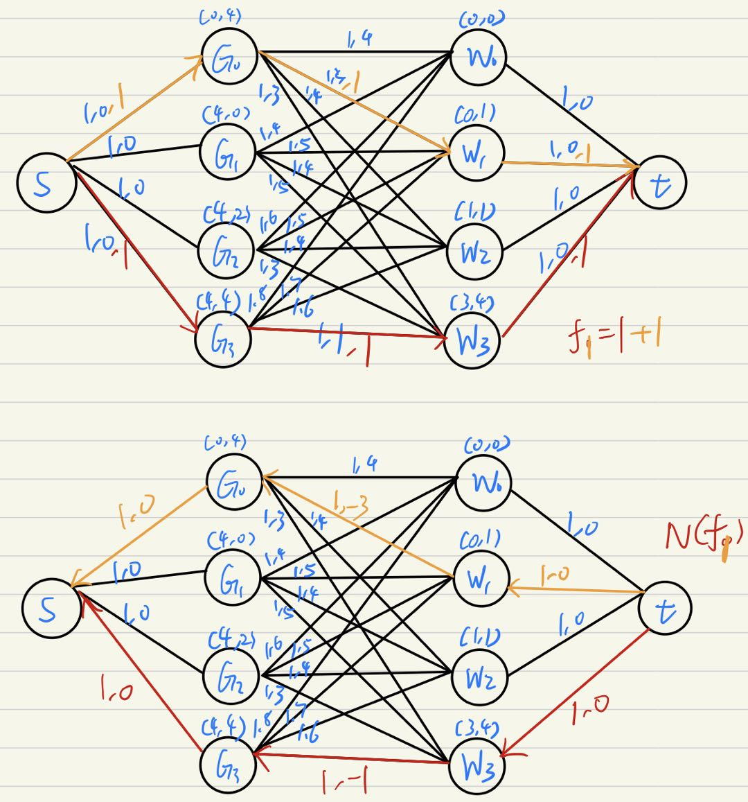 | 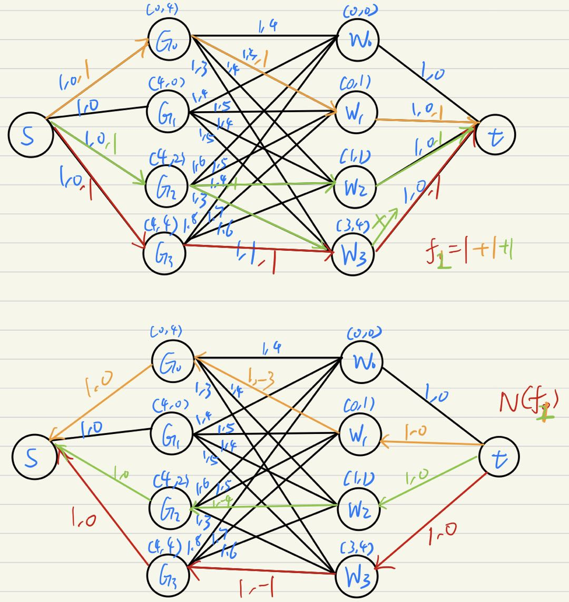 |

- 第二次查找增广链，如图中橙色字样，用spfa找到最短增广链`s-G0-W1-t`，得到可行流f1=2，更新网络N(f1)，有最少费用result=1+4
- 第三次查找增广链，如图中绿色字样，用spfa找到最短增广链`s-G2-W3-t`，但是因为`W3-t`的容量不够了，所以重新查找增广链；得到`s-G2-W2-t`，有可行流f2=3，更新网络N(f2)，有最少费用result=1+4+3

|           第四次查找增广链           |
| :----------------------------------: |
| 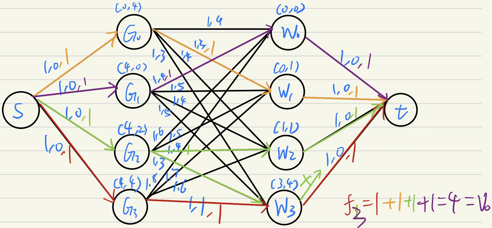 |

- 第四次查找增广链，如图中紫色字样，用spfa找到最短增广链`s-G1-W0-t`，得到可行流f3=4，有最少费用result=1+4+3+4=12，此时f3==v0，算法结束，得出最小费用result=12


##### 源代码：

文件为[code/Final/Idea_2.h](code/Final/Idea_2.h)

```c++
#ifndef IDEA_2_H
#define IDEA_2_H
//思路二：将问题转化为最小费用最大流问题问题，并使用最小费用流的最短路径算法求解
#include "Utils.h"
#include <queue>

//将仓库和货物作为节点，绘制出流量网络
//网络的边
struct edge
{
    int des;     //边的终点
    int capacity;   //边的容量
    int dist;   //距离
    int reverse;    //与该边相反的边
    edge(int dest, int cap, int dst, int rvrse) 
    {
        des = dest;
        capacity =cap;
        dist =dst;
        reverse =rvrse;
    }
};

vector<edge> Network[120];  //网络,最多100个仓库，怕有意外设120

//网络添加新的从start到des的边
void addEdge(int start, int des, int capacity, int dist){
    Network[start].push_back(edge(des, capacity, dist, Network[des].size()));//起点start加边
    Network[des].push_back(edge(start, 0, -dist, Network[start].size() - 1));//终点des加边
}
//建立网络
void getNetwork(){
    for (int i = 0; i < G.size(); i++)
    {
        addEdge(0, i + 1, 1, 0);    //网络中写入货物节点，与源点相连，原点设为0
        for (int j = 0; j < W.size(); j++)
        {
            int dist = distance(G[i], W[j]);
            addEdge(i + 1, G.size() + j + 1, 1, dist);    //网络中写入仓库节点，与货物相连
        }   
    }
    for (int i = 0; i < W.size(); i++)//仓库节点与汇点相连，汇点设为119
    {
        addEdge(G.size() + i + 1, 119, 1, 0);
    }
}

int dist[120];  // start->des的最短距离
int visit[120];  // i节点是否被访问, 0 <= i < 120
int path[120];  //最短路径经过的节点的前驱节点
int road[120];  //最短路径经过的边

//最短路径算法spfa
int spfa(int start, int des) {  
    //每次找最短路径都要初始化
    for (int i = 0; i < sizeof(dist); i++){
        dist[i] = 65536;
    }
    memset(visit, 0, sizeof(visit));
    memset(path, -1, sizeof(path));
    memset(road, -1, sizeof(road)); 
	queue<int> q;
	q.push(start);  //压入起始节点
	dist[start] = 0;
	visit[start] = 1;
	while(!q.empty()) { 
		int srch = q.front();   //正在被查询的节点
		q.pop();
		visit[srch] = 0;
		for(int i = 0; i < Network[srch].size(); i ++)  //遍历查询节点的邻接结点
        {
            edge & temp = Network[srch][i];
			if ((temp.capacity > 0) && (dist[temp.des] > dist[srch] + temp.dist)) { //dist>0代表不是反向路径，找到更段路径
				dist[temp.des] = dist[srch] + temp.dist;    //更新最短距离
				path[temp.des] = srch;  //更新当前点的前驱节点
                road[temp.des] = i;     //更新当前点到达前驱节点的路径
				if(visit[temp.des]) continue;   //如果已经到终点，结束
				visit[temp.des] = 1;    
				q.push(temp.des);
			}
		}
	}
	return dist[des] != 65536;  //返回最短路径值
}
//求出最小费用最大流
int MCMF(int s, int t) {
	int min_cost = 0, max_flow = 0;
	while(spfa(s, t)) {
		int flow = 65536;   //当前流
        //s经过最短路径，最终到达能t的流量，通过t倒着求回去
		for (int i = t; i != s; i = path[i])
        {
            flow = min(flow, Network[path[i]][road[i]].capacity);
        }
        for (int i = t; i != s; i = path[i])
        {
            min_cost += flow * Network[path[i]][road[i]].dist;  //计算最小开销
            Network[path[i]][road[i]].capacity -= flow;   //遍历辅助网络时路径容量要减去流
            Network[i][Network[path[i]][road[i]].reverse].capacity += flow;     //反向路径要加上流
        }
        max_flow += flow;   //更新最大流
	}
	return min_cost; //返回最小开销
}
//使用思路二求解
void Idea2(){
    cout << "Here is Idea_2 : input \"0 0\" to end " << endl;
    while ((cin >> n >> m) && (n > 0) && (m > 0)) { //多次输入
        if ((n == 0) && (m == 0)){
            cout << "End of Idea_2" << endl <<endl;
            return;
        }
        GetInput(n, m);     //输入
        ExtractMatrix();    //提取输入
        if (W.size() != G.size()){  //排错
            cout << "The number of warehouse and goods is inconsistent, Idea_2 is over" <<endl;
            return;
        }    
        getNetwork();   //绘制带顶点、容量的网络
        cout << "The minimum distance : " << MCMF(0, 119) <<endl;    //源点为0，汇点为119
        for (int i = 0; i < 120; i++)   //清空网络，为新的网络服务
        {
            Network[i].clear();
        }
        CleanUp();
    }
}
#endif
```

- 结构`edge`为绘制网络的边的参数；`addEdge`用于绘制网络边；`getNetwork`用于绘制网络；`spfa`即为用单源最短路算法找s-t增广链；`MCMF`便是求最小费用最大流的实现

- 该算法的核心就是`spfa`，也就是使用最短路算法查找增广链

- 因为给定流量v0就是货物/仓库数量，代码中转变可行流f'==v0条件为所有`s-t`增广链经过所有货物和仓库节点，即visit全为1

- ##### 其余部分代码均有注释，便不再赘述


## 三 实验结果

#### PRE：

文件为[code/Final/main.cpp](code/Final/main.cpp)

> ####  因为代码涉及2份思路，所以在程序运行时按照提示选择使用的思路，每个思路可以重复输入，输入`0 0`退出程序

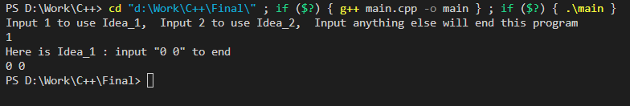


##### 输入1

```
5 5
WW..G
.W...
.....
....W
G.G.G
```

##### 输入2

```
7 8
...W....
...W....
...W....
GGGWGGGG
...W....
...W....
...W....
```

##### 思路一结果截图

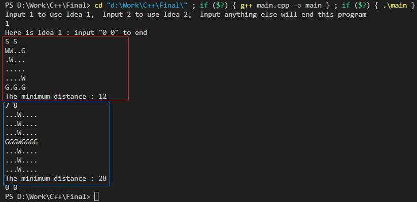

- **红框内容为输入1，结果为12**，与之前的举例所得结果一致，这证明了代码正确性
- **蓝框内容为输入2，结果为28**，为题设的例子，结果正确


##### 思路二结果截图

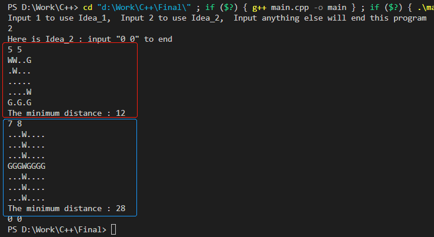

- **红框内容为输入1，结果为12**，与之前的举例所得结果一致，这证明了代码正确性
- **蓝框内容为输入2，结果为28**，为题设的例子，结果正确


> ###  思路一结果与思路二对照，结果一致，说明两种思路都能解决问题
