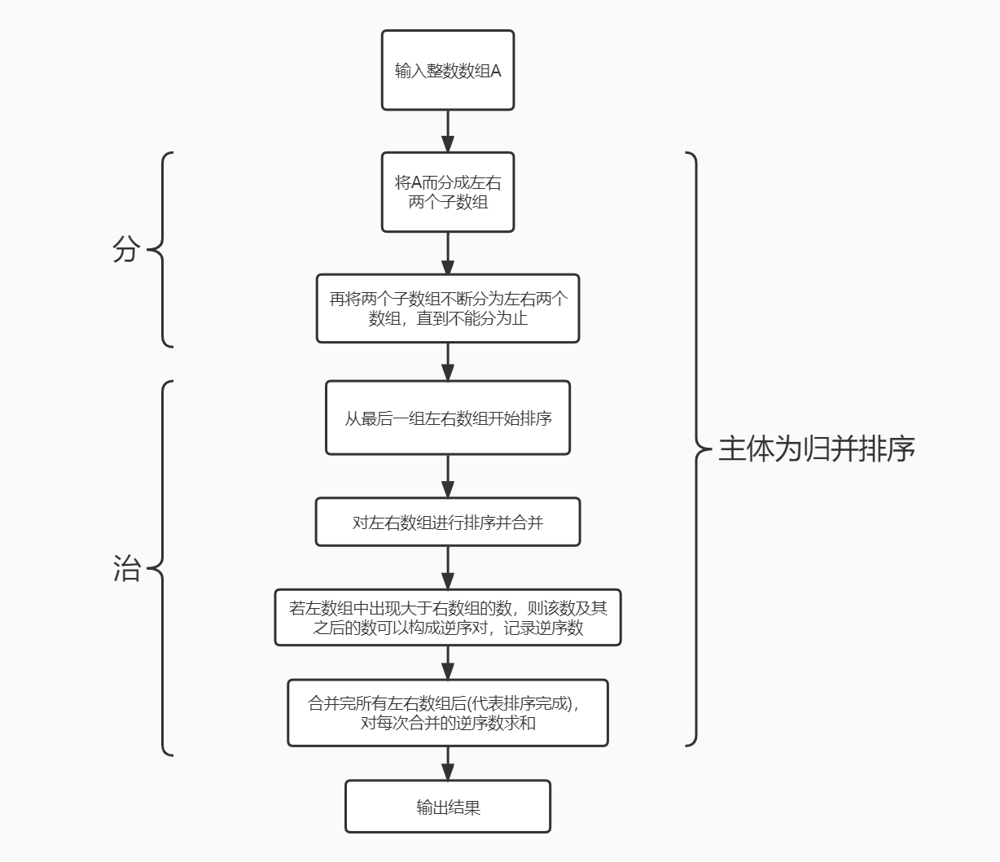
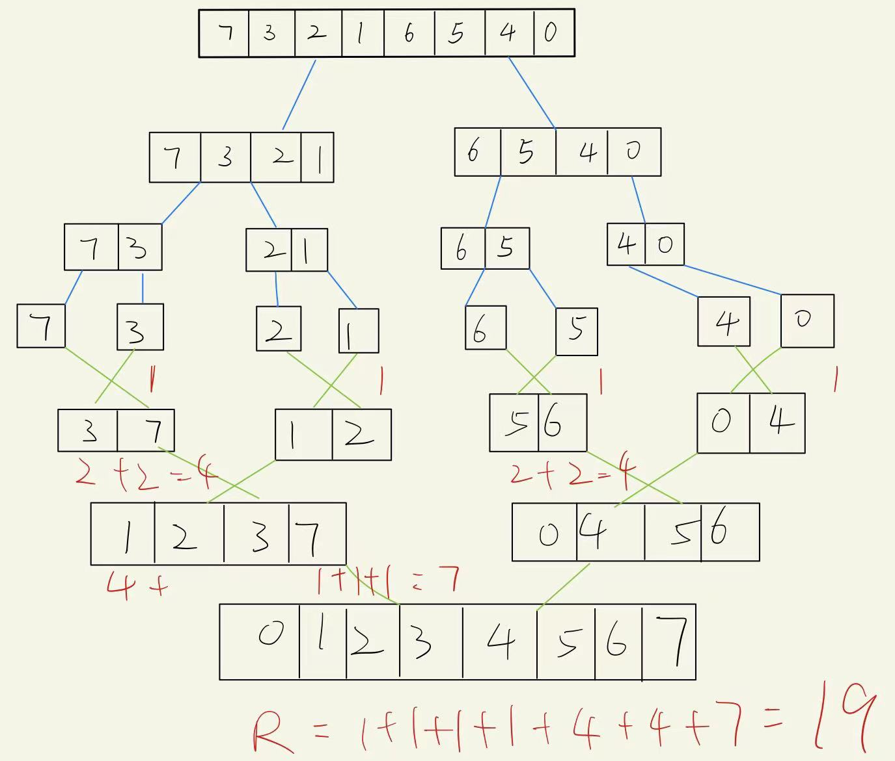
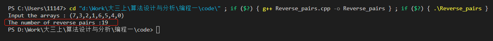
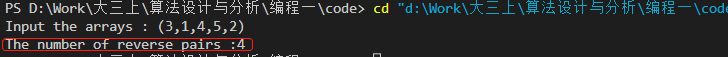

# 算法设计与分析实验报告


## 一 实验题目

##### 问题描述:

给定一个整数数组A=(a0,a1, ... ,an-1),若i< j且ai>aj，则<ai，aj>就为一个逆序对。例如数组(3,1,4,5,2)的逆序对有<3,1>、<3.2> 、<4.，2>、<5.2>。编写一个实验程序采用分治法求A中逆序对的个数，即逆序数。

##### 输入描述:

输入一个整数数组。

##### 输出描述:

输出逆序数。

##### 输入样例:

 (3,1,4,5,2)


## 二 实现思想及源代码

##### 主要思想和题目分析：

根据使用分治法的要求，采用归并排序求解问题。归并排序通过将数组不断二分为最小单位，再根据所需要的排序法则，从最小的单位开始，重复排序、合并，最后得到排序后的结果。

根据题意，逆序数就是一个**乱序数组中位置在前，但是数值更大的元素**。可以使用**升序的归并排序求解，**划分子数组的过程就是分治法中的"分"，将初始数组不断二分成左数组和右数组，所以每一次“分”都会**有对应的左右数组** 。

在合并部分，即分治法的"治"中，因为按照**升序排序**进行左右数组的合并，所以**左数组的数值理应小于右数组的数值，若有左数组的值L1大于右数组的值R1，说明L1及其之后的数都大于R1，所以这些数都可以与R1构成逆序对。**

**记录L1及其之后数字个数，作为逆序数。**当合并完成，即归并排序之后，**每次合并的逆序数的总和即为答案**。


##### 流程图：




##### 公式辅助说明：

假设输入数组Sn，其可划分为An-1、Bn-1，而An-1可再划分为An-2、An-2'，不断划分下去，A2可再划分为A1，A1'，而A1，A1'已是最小单位，即数组大小为1 。若A1>A1'，则有逆序数1，若A2有数据大于A2‘，则又有逆序数1或者2，设为r2，不断归并，左数组An-i有逆序数ri，归并到最后有逆序数R：
$$
总逆序数R = r_n+r_{n-1}+r_{n-2}+...+r_{n-i}+...+r_2+r_1
$$

##### 举例说明:

假设有数组(7,3,2,1,6,5,4,0)

首先开始进行归并排序，并在合并过程中计算逆序数，如下:



- 可见上述例子中逆序数为19 。


##### 源代码：

```c++
#include <iostream>
#include <vector>
using namespace std;

int merge_sort(vector<int> &input,int l, int r) {
    vector<int> temp(input.size()); //用于作比较的数组
    if (l >= r)
        return 0;
    int mid = (l + r) / 2;      
    int cnt = merge_sort(input,l, mid) + merge_sort(input, mid+1 , r);  //数组不断二分为若干左数组和右数组，递归实现归并排序
    int from_l = l, from_r = mid+1;     //两个指针，分别是遍历左数组、右数组
    for (int k = l; k <= r; k ++) {             //复制待排序数组
        temp[k] = input[k];
    }
    for (int k = l; k <= r; k++) {      //每一次排序，指针一共要走的长度为 l+r-1 ,即数组长度
        if(from_l == mid +1){               //代表左数组已经遍历完
            input[k] = temp[from_r++];          //填充右边数组
        }else if (from_r==r+1 ||temp[from_l] <= temp[from_r]) {     //右数组遍历完 或 左数组数字更小(代表不要排序，可以直接用)
            input[k] = temp[from_l++];              //排序数组填上左数组值
        } else {                                //出现逆序情况，即左数组的值大于右数组，需要排序
            input[k] = temp[from_r++];          //填上右数组值
            cnt+=mid-from_l+1;              //因为from_l之前的左数组已经排序完成，说明剩下的数字都大于当前填入右数组值，所以都可构成为逆序对
        }
    }
    return cnt;
}

int main(){
	vector<int> input;		//输入数组
    cout<<"Input the arrays : ";	
    string istr;		//输入字符串
    cin >> istr; 
    for (auto &p : istr){		//格式化输入，读取数组
        if (p == ',' || p == '(' || p == ')'){
            p = ' ';
        }else{
            input.push_back(p-'0');
        }
    }
    int res = merge_sort(input,0,input.size()-1);	//得到结果
    cout<<"The number of reverse pairs :"<<res<<endl;
	return 0;
}
```

- 改算法主体为**归并排序，事实上只增加了**

  ```c++
  cnt+=mid-from_l+1; 
  ```

  作为逆序数的计算

- 设置3个数组，一个用于复制输入数组，而排序结果直接覆盖输入，另外两个分别作为左右子数组

  - 设置两个标识from_l和from_r，分别用于遍历左子数组、右子数组

  - 若**from_r指向左子数组的值**大于**from_r指向右子数组的值，则记录该值及其之后值的个数，所谓逆序数**

  - ##### 若其中一个子数组遍历完毕，记得将另一个子数组数据全装进结果中，这才算完成一次合并

  - 所有子数组合并完成后，对所有逆序数求和即为最终结果

- 其他代码意义均在注释给出，便不再赘述


## 三 实验结果

##### 输入格式

(7,3,2,1,6,5,4,0)

- 注意括号为半角括号 "("
- 以逗号分隔数字，换行结束输入

##### 输入(7,3,2,1,6,5,4,0)



- 与之前的举例所得结果一致，这证明了代码正确性。

##### 输入(3,1,4,5,2)



- 该例为题目中的例子，结果正确
