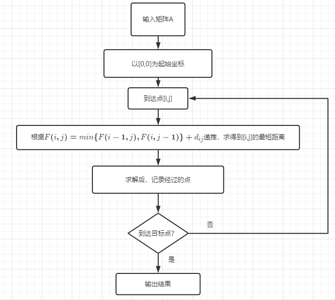
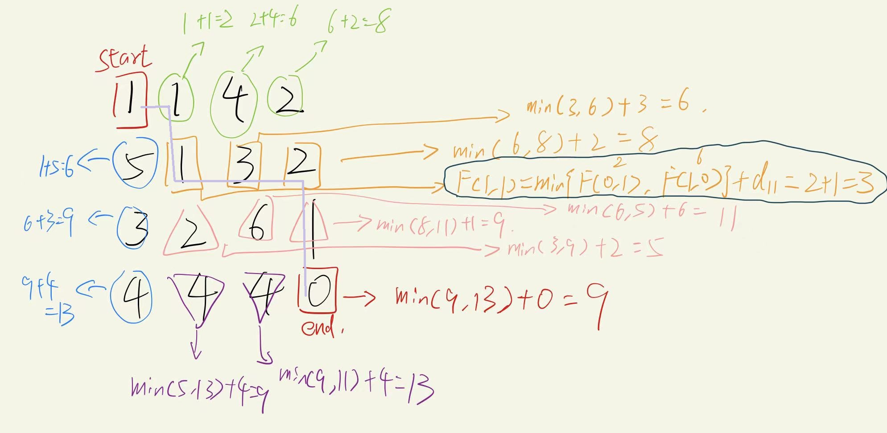
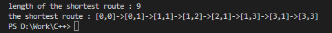
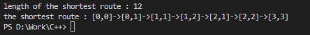

# 算法设计与分析实验报告


## 一 实验题目

##### 问题描述:

给定一个m行n列的矩阵，从左上角开始每次只能向右或者向下移动，最后到达右下角的位置，路径上的所有数字累加起来作为这条路径的路径和。编写一个实验程序使用动态规划方法求所有路径和中的最小路径和，并给出具体路径。

##### 输入描述:

输入一个矩阵。

##### 输出描述:

输出最短路径和以及路径

##### 输入样例:

$$
1&3&5&9\\8&1&3&4\\5&0&6&1\\8&8&4&0
$$


## 二 实现思想及源代码

##### 主要思想和题目分析：

使用动态规划的思想，先将题目划分为若干个子问题，对子问题求解后，将子问题的解保存，需要子问题答案时可以直接获得，从而达到**逐步动态逼近**最优解，避免重复计算。

为了求得矩阵左上角到右下角的最短路径，因为运动方式**只能往下和往右，所以位置[i,j]的距离可以由[i-1,j]或[i,j-1]加上本身得到。**所以矩阵中所有位置的距离都可以由**该位置的上一个位置的距离值求出，**而为了得到最短距离，**便是每个位置的上一个位置，选择上一个位置的距离最小的。**也由此将原问题分解为**求当前位置的上一个位置的最小距离。**


##### 流程图：




##### 公式辅助说明：

根据题意，为使用动态规划求得矩阵的左上角到达右下角的最短路径以及最短路径长度，可以得到问题描述
$$
以矩阵左上角为[0,0],[i,j]为目的地,m为矩阵行数，n为矩阵列数,d_{ij}d_{ij}为矩阵坐标对应的值\\
min\sum_{i=0}^{m}\sum_{j=1}^{n}d_{ij}\\
$$
设F(i,j)为[0,0]到[i,j]的最短路径长度，则有
$$
F(i,j)=min\{F(i-1,j),F(i,j-1)\}+d_{ij}
$$

##### 举例说明:

有矩阵：
$$
1&1&4&2\\5&1&3&2\\3&2&6&1\\4&4&4&0
$$
使用上述公式分析有



- 其中**墨绿色中对F[1,1]的求解为详细公式**，剩下为了简便，直接带入数据

- 蓝色和绿色框为[0,0]可直线到达的区域，**这时直接朝左或者朝下的距离一定是最短的**

- ##### 淡紫色线条代表最短路径

- ##### 当点到达F(1,1)时，若使用贪心算法，会选择当前最小的F(2,1)，即粉红框中的2，但真正的最短路要选择F(2,1)

- ##### 红色框为结果，即最短路径长度为9


##### 源代码：

```c++
#include <iostream>
#include "stdlib.h"
#include <vector>
#include <string>
#include <algorithm>

using namespace std;
vector<string> t;	//标记，存最短路径
int shortest_route_dp(vector<vector<int>> put)
{
	if(put.size()==0||put[0].size()==0)return -1;		
	int row_len = put.size();
	int col_len = put[0].size();
	vector<int> col(col_len);
	vector<vector<int>>dp(row_len,col);		//备忘录，用于存矩阵中起点到各点的最小距离，基于F(i,j)=min{F(i-1,j),F(i,j-1)}+F(i,j)更新
	dp[0][0] = put[0][0];
	for(int i = 1; i < col_len; ++i) {		//第一行和第一列的F(i,j)，最短为直线前进
		dp[0][i] = dp[0][i-1] + put[0][i];	//可以简化为F(i,j)=F(i-1,j)+F(i,j)
    	dp[i][0] = dp[i-1][0] + put[i][0];	//和F(i,j)=F(i,j-1)+F(i,j)
	}
	for(int i = 1; i < row_len; ++i) {		//对于剩下的点进行判断
		for(int j = 1; j < col_len; ++j) {
			if (dp[i-1][j] < dp[i][j-1]) {	//F(i,j)=min{F(i-1,j),F(i,j-1)}+F(i,j)，因为要输出路径，所以使用if而不是min{}
				dp[i][j] = dp[i-1][j] + put[i][j];
				//拼接字符串用于输出
				string temp = "["+to_string(i-1)+",";	
				temp += to_string(j)+"]";
				//如果不在标志vector中，则加入，作为最短路径节点
				vector<string>::iterator ti=find(t.begin(),t.end(),temp);
				if (ti==t.end()){
					t.push_back(temp);	
				}
			}else{
				dp[i][j] = dp[i][j-1] + put[i][j];
				//拼接字符串用于输出
				string temp = "["+to_string(i)+",";	
				temp += to_string(j-1)+"]";
				//如果不在标志vector中，则加入，作为最短路径节点
				vector<string>::iterator ti=find(t.begin(),t.end(),temp);
				if (ti==t.end()){
					t.push_back(temp);	
				}
			}	
		}
	}
	return dp[row_len-1][col_len-1];
}
int main()
{
	vector<vector <int>> input_matrix={{1,3,5,9},{8,1,3,4},{5,0,6,1},{8,8,4,0}};	//输入矩阵
	cout <<"length of the shortest route : "<<shortest_route_dp(input_matrix)<< endl;	
	cout <<"the shortest route : [0,0]->";	
	for (int i = 0; i <t.size()-1 ; i++){
		cout<<t[i]<<"->";
	}
	cout<<"["<<input_matrix[0].size()-1<<","<<input_matrix.size()-1<<"]"<<endl;
	return 0;
}
```

- 在求解函数shortest_route_dp中，设置1个二维vector作为备忘录，用于记录从[0,0]到各点的距离，**即存储子问题的解**

  - 设置两个标识from_l和from_r，分别用于遍历左子数组、右子数组

  - ##### 函数返回的dp\[row_len-1\]\[col_len-1\]即为到右下角的最短路径

- ##### 全局的vector t，作为标记函数的存储点，即存最短路径


## 三 实验结果

##### 输入

更改

```c++
vector<vector <int>> input_matrix={{1,3,5,9},{8,1,3,4},{5,0,6,1},{8,8,4,0}};	//输入矩阵
```

即可

##### 输入

$$
1&1&4&2\\5&1&3&2\\3&2&6&1\\4&4&4&0
$$



- 与之前的举例所得结果一致，这证明了代码正确性。

##### 输入

$$
1&3&5&9\\8&1&3&4\\5&0&6&1\\8&8&4&0
$$



- 该例为题目中的例子，结果正确
