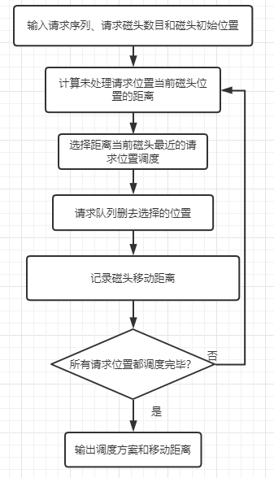
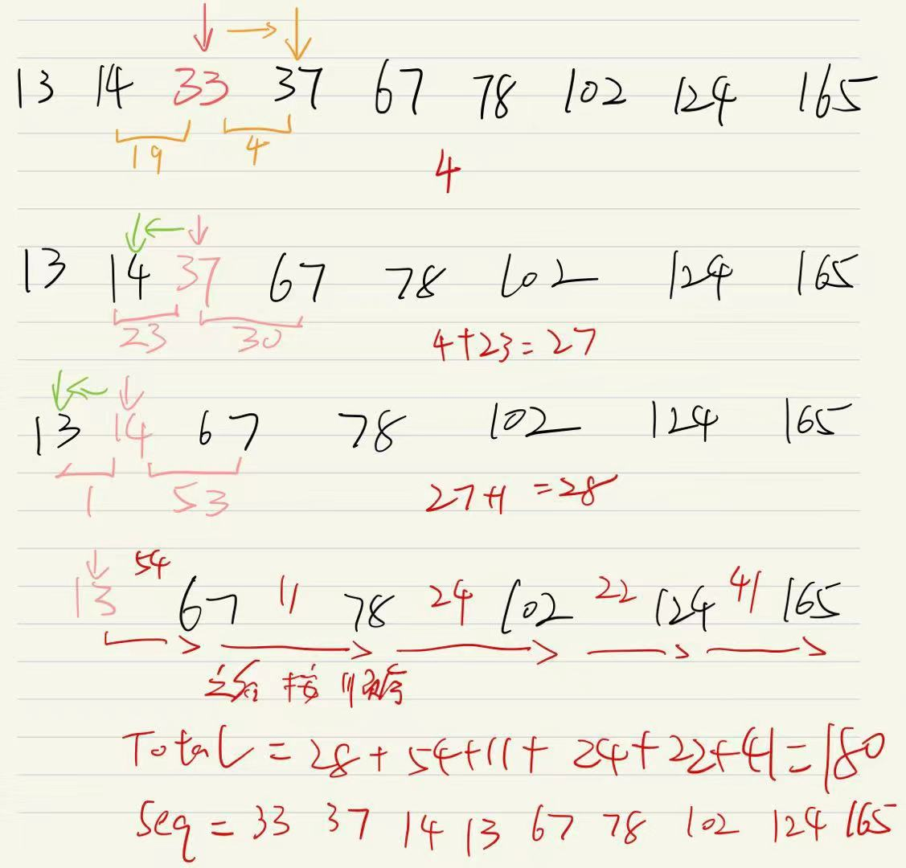
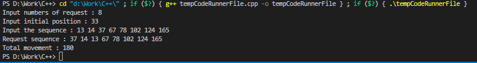
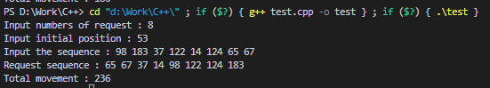
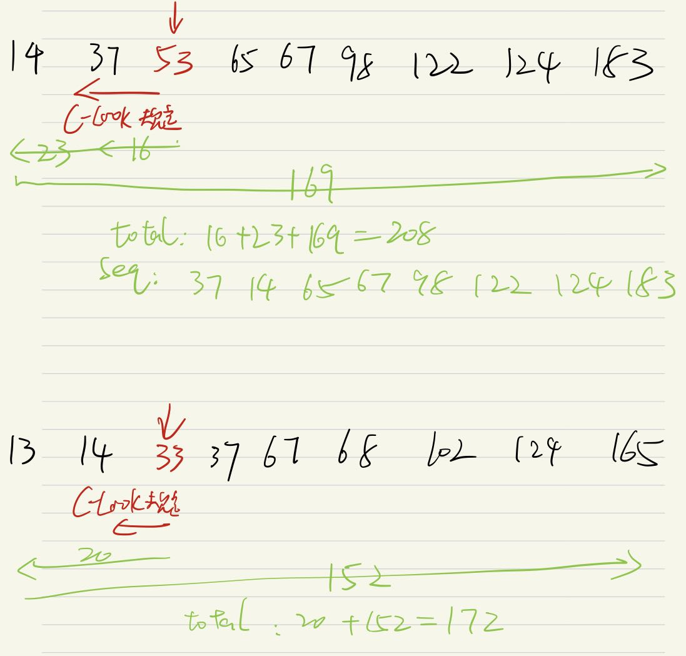

# 算法设计与分析实验报告

## 一 实验题目

##### 问题描述:

有一个磁盘请求序列给出了程序的I/O对各个柱面上数据块请求的顺序，例如一个请求序列98，183，37，122，14，124，65，67，n=8，请求编号为1~n。如果磁头开始位于位置C(假设不在任何请求的位置，例如C为53)。试使用贪心法编程输出给定的磁盘请求序列的调度方案和磁头移动总数。

##### 输入描述:

输入待处理序列、请求序列的数目、磁头的初始位置

##### 输出描述:

请求序列的调度方案、磁头移动总数

##### 输入样例:

```
8
53
98 183 37 122 14 124 65 67
```


## 二 实现思想及源代码

##### 主要思想和题目分析：

根据动态规划的思想，对问题的求解分成若干个步骤，对每一个步骤都使用贪心原则，即**每次都选取当前状态下最好的结果，或者说是局部最有利的结果**。欲从每次最优从而得到全局最优。

为了得到给定的磁盘请求序列的调度方案和磁头移动总数，根据贪心算法，便是在每次磁头调度时，**选择距离当前磁头最近的位置作为下一个磁头到达地点**。之后反复从新的当前位置进行贪心策略选择，直到所有位置接受调度服务。

**使用贪心策略也叫作SSTF调度算法**


##### 流程图：




##### 公式辅助说明：

根据题意，使用贪心算法在每次磁头调度前，计算请求序列中距离磁头最近的位置，每次都选择离磁头最近的进行调度
$$
设有请求位置与磁头距离distance，当前位置now,请求序列S=\{1,2,3,...,n\}\\
则distance=min\{now-1,now-2,...,now-i,...,now-n\}\\
若i最小，则now=i,并将i从S中取出，放入调度方案，直到S为空
$$
##### 举例说明:

有请求序列

```
78 13 37 102 14 124 165 67
```

初始位置

```
33
```

使用上述公式分析有




##### 源代码：

```c++
#include <iostream>
#include <vector>
#include <math.h>
#include<stdio.h>
using namespace std;

int greedy(vector<int>& put,vector<int>& out, int start,int n){
	int total=0;
	int now=start;		//当前磁头位置
	for (int i = 0; i < n; i++){		//遍历所有请求位置
		int next=0,index=0;			//下一个磁头位置
		int min_delt=999999;		//距离差，为贪心，取最小的为下一个磁头位置
		for (int j = 0; j < put.size(); j++)		//遍历未处理请求位置
		{	
			if (abs(now-put[j])<=min_delt)		//求距离差
			{
				min_delt = abs(now-put[j]);		//更新距离差
				next = put[j];				//更新当前最近磁头位置
				index=j;
			}
		}
		now=next;			//更新最近磁头
		put.erase(put.begin()+index);		//除去已经处理请求位置
		total+= min_delt;			//磁头移动距离
		out.push_back(now);			//处理序列
	}
	return total;
}

int main(){
	vector<int> request;	 //请求队列
	vector<int> reply;			//处理队列
	int total=0;				//磁头移动总长
	int n,start;				//请求数目、磁头初始位置
	//输入
	cout<<"Input numbers of request : ";		
	cin>>n;						
	cout<<"Input initial position : ";
	cin>>start;
	cout<<"Input the sequence : ";
	for (int i = 0; i < n; i++)
	{
		int temp;
		cin>>temp;
		request.push_back(temp);
	}
	//贪心算法计算
	total = greedy(request,reply,start,n);
	cout<<"Request sequence : ";
	//输出
	for (int i = 0; i < reply.size(); i++)
	{
		cout<<reply[i]<<' ';
	}
	cout<<endl<<"Total movement : "<<total;	
	return 0;
}
```

- ##### 本次算法核心就是min_delt，用于得到距离当前磁头最近的磁头，贪心算法便是选取该最近磁头进行服务，每次服务都是服务距离当前磁头最近的磁头

- ##### 注意在处理完一个磁头就要从待处理数组request中取出


## 三 实验结果

##### 输入

```c++
8
33
13 14 37 67 78 102 124 165
```

##### 结果



- 与之前的举例所得结果一致，这证明了代码正确性。

##### 输入

```c++
8
53
98 183 37 122 14 124 65 67
```

##### 结果



- 该例为题目中的例子，结果正确


## 四 算法问题

**贪心算法可以认为是为磁盘调度的SSTF算法，该算法可以解决大部分磁盘调度问题。但是SSTF并不一定能够得到最少的磁盘移动距离**

##### C-LOOK

规定磁头只往外或内一个方向移动时才访问，否 则只是快速移动到起点，对于以上给的样例，**先规定向内移动再向外即可**


##### 就最少磁头移动而言，C-LOOK更优于SSTF




##### 但是SSTF的平均移动距离和请求等待是最小的，对于序列中的请求而言更加公平，所以SSTF是最常用的磁盘调度算法

 

