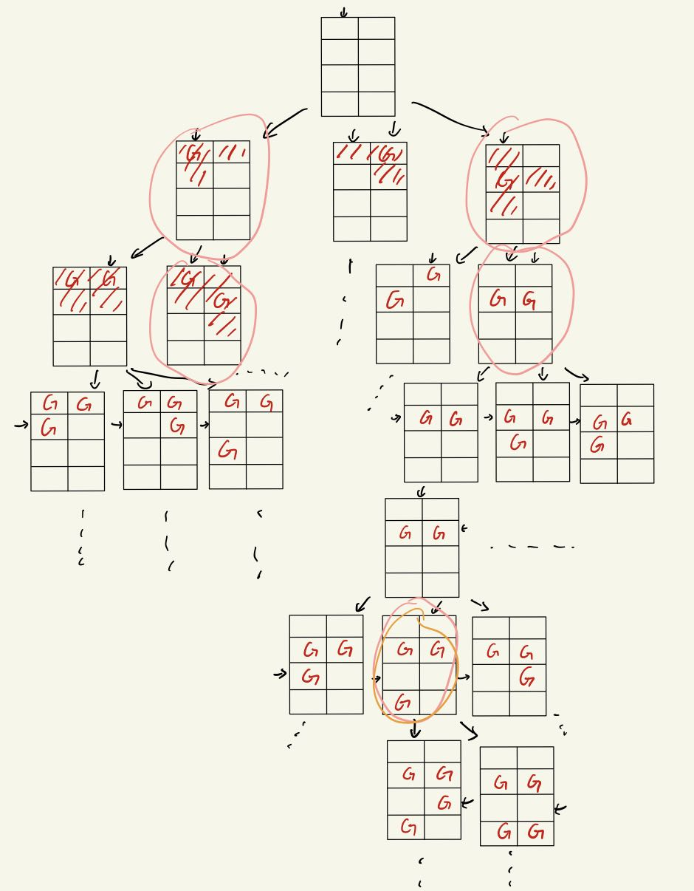

# 算法设计与分析实验报告

## 一 实验题目

##### 问题描述:

哨兵布置问题。一个博物馆由排成m*n个矩阵阵列的陈列室组成，需要在陈列室中设立哨位，每个哨位上的哨兵除了可以监视自己所在陈列室外，还可以监视他上、下、左、右四个陈列室，试基于分支限界法给出一个最佳哨位安排方法，使得所有陈列室都在监视之下，但使用的哨兵最少。

##### 输入描述:

由文件input.txt给出输入数据。第1行有2个正整数m和n。

##### 输出描述:

将计算出的哨兵人数及其最佳哨位安排输出到文件output.txt。文件的第1行是哨兵人数，接下来的m行中每行n个数，0表示无哨位，1表示哨位。

##### 输入样例:

```
4 4
```


## 二 实现思想及源代码

##### 主要思想和题目分析：

根据分支界限的思想，问题的求解都可以根据状态来形成序列，其中可化为解空间树，根据最小损耗优先遍历节点，根据约束在满足约束的解中找到最优状态即为解，即**选择最小损耗的节点，根据界进行扩展(扩展活结点)，得到子节点，即下一个节点(状态)，判断是否越界且符合条件，再选择是否再次扩展还是结束算法**

- ##### 分支就在于如何扩展子节点，界限就用于判断是否扩展子节点。所以分支界限是较为“聪明”的枚举

为了得到最少哨兵数和哨兵排布，**先将所有陈列室的已有哨兵布局、数目和已监视房间布局、数目作为节点**，根据分支界限方法，**从根节点开始根据界进行扩展**。

**界：已监视陈列室数，上界陈列室总数=n*m，只有未被监视的陈列室才能扩展。**

从上到下、从左到右遍历陈列室，所以节点扩展只有3种方式：当前节点坐标本身放置哨兵、当前节点坐标右一个坐标放置哨兵、当前节点下一个坐标放置哨兵，**每个陈列室只能放置一个守卫**，如下图分析：

  

- G代表放置了哨兵，对应颜色斜线代表该哨兵的监视范围，绿色箭头代表遍历到的当前节点坐标

- 粉色G代表当前坐标放置哨兵；橙色G代表当前坐标右边位置放置哨兵；蓝色G当前坐标下方位置放置哨兵

- #### 可以得到三种扩展的条件

  - ##### 坐标放置哨兵：只要i<n，即当前坐标在范围内即可扩展

  - ##### 坐标右边位置放置哨兵：坐标右边位置未被监视，如果右边位置已被监视，那么再扩展节点会造成浪费

  - ##### 坐标下方位置放置哨兵：坐标未到下边界，即j！=m为前提；坐标下方位置或坐标下方位置的下方未被监视。正如图中分析，在下方位置可扩展的情况下，扩展下方位置的监视房间数最多，即最优，所以尽量选择扩展下方位置节点。

    - 如果下方位置的下方未被监视，那么扩展下方位置效果可以达到最佳；**否则效果也和其他两种情况的最优效果一致**


扩展节点到所有陈列室被监视，即超过界则停止扩展，此时根据最少哨兵数继续遍历解空间，直到得到最优解。


##### 流程图：


##### 公式辅助说明：

根据题意，设有解向量$x=<x_{1*1},x_{1*2},..,x_{i*j}...,x_{m*n}>$，其中x向量有x~i*j~=0，代表陈列室坐标(i,j)没有哨兵，x~i*j~=1设置哨兵

代价：向量x中x~i*j~=1的数目，即已放置哨兵数目

界：被监视陈列室数目，可设为向量$y=<y_{1*1},y_{1*2},..,y_{i*j}...,y_{m*n}>$，其中y~i*j~=0代表陈列室未被监视，y~i*j~=1代表被1个哨兵监视，y~i*j~=2代表被2个哨兵监视。只有y~i*j~=0的陈列室才可以放置守卫。**上界为陈列室数目，即n*m**

只有在向量y中所有y~i*j~的值都大于等于1，即y~i*j~值大于等于1的**数量=n*m**或者都不满足三种扩展条件，才停止扩展，由此得到完整的解空间，之后根据优先队列在解空间中找最小代价的解


##### 举例说明:

输入文件input.txt

```
1 1
1 3
1 5
4 2
6 3
7 4
```

对`1 3`和`4 2`分析有

###### `1 3`


- n=1，m=3的情况下，除了j=3，只有1种扩展，剩下情况节点都有2种扩展方式，所以会有11种情况，**即如果枚举全部节点，会有11个节点**

- 使用分支界限，以已监视陈列室数量为界，**解空间就只有粉色框中的4个节点，按照哨兵数使用优先队列存，则可以得到最优解为橙框内容。**解为

  ```
  哨兵数：1
  0 1 0
  ```


###### `4 2`



- n=4，m=2的情况下，除了右边界情况只有2种扩展，矩阵右下角只有1中扩展，剩下情况节点都有3种扩展方式，所以会有$\sum_{n=1}^82^{n/2}*3^{n/2}=1036$种情况，**即如果枚举全部节点，会有1036个节点**

- 使用分支界限，以已监视陈列室数量为界、有扩展节点条件限制，**解空间就只有粉色框中的节点，程序计算就6个节点，出按照哨兵数使用优先队列存，则可以得到最优解为橙框内容。**解为

  ```
  哨兵数：3
  0 0 
  1 1 
  0 0 
  1 0
  ```

  

##### 源代码：

```c++
#include <iostream>
#include <vector>
#include <fstream>
#include <queue>
#include <algorithm>
#include <string.h>

using namespace std;
//读入文件
vector<vector<int>> file_input(){
	ifstream input("input.txt");	//开文件
	if(!input.is_open())
		std::cerr << "cannot open the file";	//排错
	vector<vector<int>> t;		//读取m，n存入二维数组，因为输入可能有多组
	while (!input.eof())		//读完文件
	{
		vector<int> temp = {0,0};
		input >> temp[0] >> temp[1];	//读入转化为int并存入vector
		t.push_back(temp);
	}
	input.close();		//读完
	return t;
}
//写结果
void file_output(int r, vector<vector<int>> &result){
	ofstream output("output.txt", ios::app);		//开文件，每有一个结果就写一次
	if(!output.is_open())
		std::cerr << "cannot open the file";
	//写入哨兵数量和哨兵分布矩阵
	output << "The number of guards : " << r <<endl;	
	for (int i = 0; i < result.size(); i++)
	{
		for (int j = 0; j < result[i].size(); j++)
		{
			output<<result[i][j]<<" ";
		}
		output<<endl;
	}
	output<<"------------"<<endl;
	output.close();		//写完
	return;
}

struct Node		//以每一个陈列室为节点
{
	vector<vector<int>> place_of_guards;	//所有陈列室哨兵的分布
	vector<vector<int>> room_in_sight;		//所有陈列室已经被监视的房间
	int i = 0, j = 0;					//当前陈列室坐标
	int numbers_of_guards = 0, numbers_of_sights = 0;	//当前已有哨兵数(代价)，当前已监视房间数
};

struct cmp 		//重载优先队列的比较函数
{
    bool operator() (Node x, Node y)
    {
        return x.numbers_of_guards > y.numbers_of_guards; 	//哨兵数目(代价少)的节点优先
    }
};

// bool judge(Node x, Node y)		//重载sort()比较规则，监视房间数多的节点优先
// {
//     return x.numbers_of_sights < y.numbers_of_sights;
// }
int sfg[5][2] = {{0, 0}, {0, 1}, {0, -1}, {1, 0}, {-1, 0}};		//哨兵的监视范围
priority_queue<Node, vector<Node>, cmp> tree;		//使用优先队列存节点
// vector<Node> tree;		//使用vector存

void set_guard(Node put, int x, int y, int n, int m){	//分支，放置哨兵
	if (x >= n || y >= m)	//边界检查，不能在范围外放哨兵
	{
		return;
	}
	Node temp;			//复制当前节点，用于生成下一个节点
	temp.i = put.i;
	temp.j = put.j;
	temp.numbers_of_sights = put.numbers_of_sights;
	//复制当前节点的哨兵排布
	temp.room_in_sight.resize(n,vector<int>(m,0));
	for (int l = 0; l < n; l++)
		temp.room_in_sight[l].assign(put.room_in_sight[l].begin(), put.room_in_sight[l].end());
	//复制当前节点已监视房间排布
	temp.place_of_guards.resize(n,vector<int>(m,0));
	for (int l = 0; l < n; l++)
		temp.place_of_guards[l].assign(put.place_of_guards[l].begin(),put.place_of_guards[l].end());

	temp.place_of_guards[x][y] = 1;		//在输入位置放哨兵
	temp.numbers_of_guards = put.numbers_of_guards + 1;		//哨兵数+1
	for (int k = 0; k < 5; k++)		//更新新放置哨兵后的监视范围
	{
		int near_x = x + sfg[k][0];
		int near_y = y + sfg[k][1];	
		if (near_x < 0 || near_y < 0 || near_x >= n || near_y >= m)		//更新范围边界检查
			continue;
		temp.room_in_sight[near_x][near_y]++;		
		if (temp.room_in_sight[near_x][near_y] == 1)	//为1代表，房间首次被监视
			temp.numbers_of_sights++;		//增加已监视房间数
	}
	
    while(temp.i < n && temp.room_in_sight[temp.i][temp.j]) //当前节点位置坐标更新，更新为下一个节点位置
	{
		temp.j++;
		if(temp.j >= m)
		{
			temp.i++;
			temp.j = 0; 
		}
	}
	// tree.push_back(temp);
	// sort(tree.begin(), tree.end(), judge);
	tree.push(temp);		//加入树中
	return ;
};

void branch_and_bound(int n, int m){		//分支界限法
	vector<vector<int>> result(n,vector<int>(m,0)); 	//结果的哨兵布局
	int numbers_of_guards = 9999;	
	Node node;			//根节点初始化
	node.place_of_guards.resize(n,vector<int>(m,0));
	node.room_in_sight.resize(n,vector<int>(m,0));		
	// tree.push_back(node);
	tree.push(node);		//根节点加入

	while (!tree.empty())	//最小损耗优先遍历节点
	{
		// Node now = tree.front();
		Node now = tree.top();	
		// tree.erase(tree.begin());
		tree.pop();
		if (now.numbers_of_guards > numbers_of_guards) continue;	
	
		if ((now.numbers_of_sights < n*m))	//界限，根据界扩展结点，界为已监视房间数目
		{	
			if (now.i < n)				//根据界限设置子节点一 
				set_guard(now, now.i+1, now.j, n, m);			
			if(now.room_in_sight[now.i][now.j+1] == 0)//根据界限设置子节点二
				set_guard(now, now.i, now.j, n, m);
			if (now.j + 2 < m)	//边界检查
			{
				if(now.j < m && (now.room_in_sight[now.i][now.j+1] == 0 || now.room_in_sight[now.i][now.j+2] == 0))//根据界限设置子节点三
					set_guard(now, now.i, now.j+1, n, m);
			}
		}else{	//每个房间都至少有一个哨兵监视
			if (now.numbers_of_guards < numbers_of_guards)		//选最小哨兵数的节点作为结果
			{
				numbers_of_guards = now.numbers_of_guards;
				for (int l = 0; l < n; l++)
					result[l].assign(now.place_of_guards[l].begin(), now.place_of_guards[l].end());
			}
		}
	}	
	if (n == 1 && m == 1)		//只有一个陈列室特殊情况
	{
		numbers_of_guards = 1;
		result[0][0] = 1;
	}
	
	cout<<"The number of guards : "<<numbers_of_guards<<endl;	//屏幕打印  
	for (int r = 0; r < n; r++)
	{
		for (int q = 0; q < m; q++)
		{
			cout<<result[r][q]<<" ";
		}
		cout<<endl;
	}	
	cout<<"------------"<<endl;
	file_output(numbers_of_guards, result);		//写入输出文件
	return;
}

int main(){
	vector<vector<int>> input = file_input();	//读入输入 
	for (int i = 0; i < input.size(); i++)
	{	
		int n = input[i][0], m = input[i][1];
		branch_and_bound(n, m);
	}
	return 0;
}
```

- ##### 本方法核心为分3种情况按界限条件扩展节点以及放置守卫的分支方式

- set_guard函数体现分支界限的“分支”；branch_and_bound体现分支界限的“界限”


## 三 实验结果

##### 输入n！=m

```c++
1 1
1 3
1 5
4 2
6 3
7 4
```

##### 结果


- 与之前的举例所得结果一致，这证明了代码正确性

- 可以看到output.txt生成，内容为

  


##### 输入n==m

```c++
2 2
3 3
4 4
5 5
6 6
7 7
```

##### 结果


- 其中4 4该例为题目中的例子，结果正确

  ```
  The number of guards : 4
  0 0 1 0
  1 0 0 0
  0 0 0 1
  0 1 0 0
  ```

- 可以看到output.txt生成，内容为

  


 

## 四 心得

个人认为本题使用分支界限法的难点在于寻找“界”，和对界处理。如何以文字形式描述并证明很难。(希望我写对了)
